一个基于 Path Tracing 的光线追踪渲染器。

- 使用了基于光源面积的采样
- 实现了 Lambert 着色（后续会引入 Phong 着色以及微表面模型）
- 导出必要的光线信息，支持可视化地对每一根光线 debug


## debug 的示意图


## 路径追踪的结果

参数：400px，256spp


## 坐标系相关

这里有三个坐标系：世界坐标系，摄像机坐标系，屏幕坐标系。

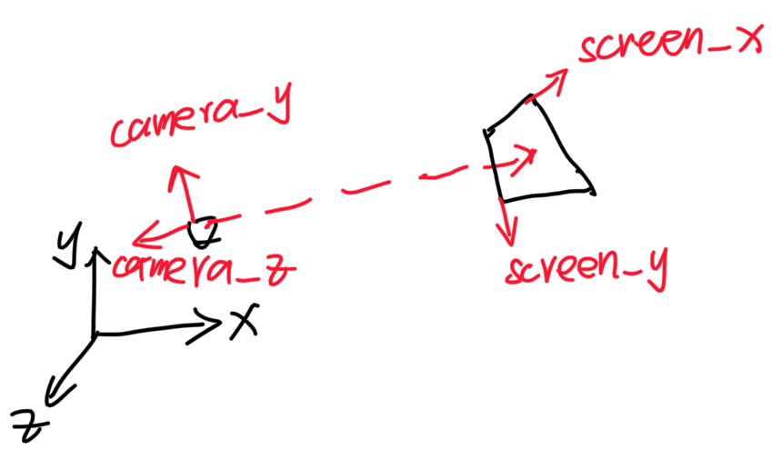


### 1. 摄像机坐标系

摄像机坐标系固定在摄像机上，`-z` 为摄像机的朝向，不考虑摄像机的桶滚运动，`+x` 为摄像机的右方向：

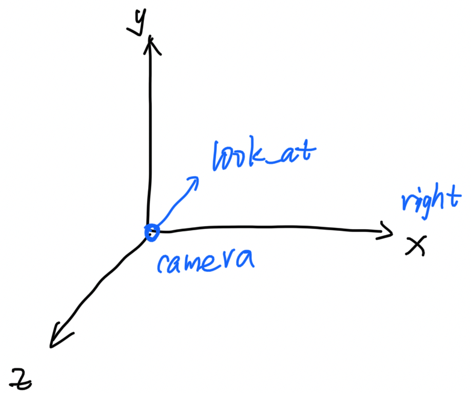

摄像机坐标系的基向量可以表示为：

```cpp
coor_camera_z = -look_at;
coor_camera_x = cross(vec3(0, 1, 0), coor_camera_z);
coor_camera_y = cross(coor_camera_z, coor_camera_x);
```


从摄像机坐标系变换到世界坐标系：（其中 `i, j, k` 表示摄像机坐标系的基向量，`e` 表示摄像机在世界坐标系的位置）
$$
Pos_{world} = 
\left[\begin{array}{ccc}
i_x && j_x && k_x && e_x \\
i_y && j_y && k_y && e_y \\
i_z && j_z && k_z && e_z \\
0 && 0 && 0 && 1
\end{array}\right]
\cdot {Pos}_{camera}
$$


### 2. 屏幕坐标系

屏幕坐标系位于摄像机坐标系中。

一般来说，摄像机正对着屏幕，距屏幕一定的距离：

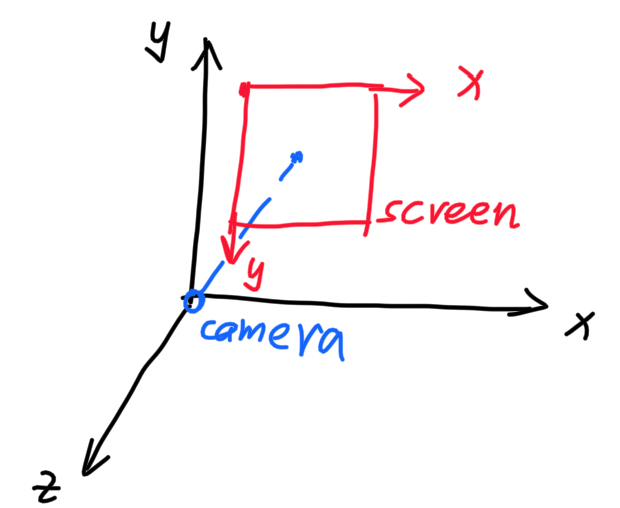


屏幕坐标系中的一个像素点 `(x_screen, y_screen)` 如何转化为摄像机坐标系中的坐标 `(x_view, y_view)` 

需要定义以下参数：

- 摄像机到屏幕的距离：`dis` 
- 摄像机的视场角：`fov` 
- 屏幕的宽高比：`aspect` 
- 屏幕的像素：`screen_h` （可以计算出 `screen_w`）


可以计算出，投影平面的宽和高：

```cpp
view_h = 2 * tan(fov / 2) * dis;
view_w = height * aspect;
```

屏幕坐标和投影平面坐标的对应关系：

```
   屏幕中像素的坐标值            投影平面的坐标值
x: [0       , screen_w]   ->   [-view_w / 2, view_w / 2]
y: [screen_h, 0       ]   ->   [-view_h / 2, view_h / 2]
z:                        ->   -1
```

变换公式为：（考虑到像素中心点在每个像素的中央，所以这里使用 0.5 ）
$$
x_{view} = (\frac{x_{screen}}{W_{screen}} - 0.5) * \frac{W_{view}}{2} \\
y_{view} = (0.5 - \frac{y_{screen}}{H_{screen}}) * \frac{H_{view}}{2}
$$


### 3. Blender 的坐标系

将物体导入后，其 local 坐标系和 global 坐标系的对应图：

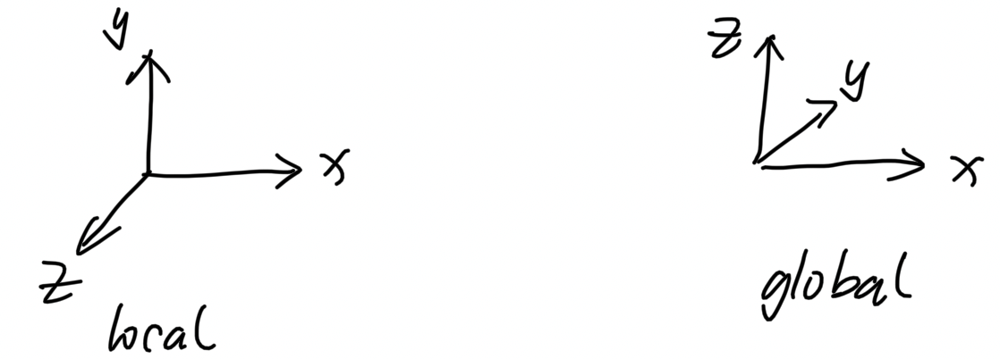


### 4. Cornell-box 的位姿

这个应用中使用的 cornell-box，其位姿为（local 坐标系）：

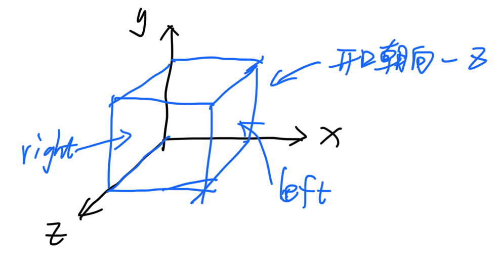


## 路径的记录

为了实现 debug 功能，需要将所有的光路信息都记录下来。


光路由许多的路径节点组成，路径节点主要包含一下信息：

- 交点信息：交点的位置，材质，法线等
- 入射，出射光线的 Radiance 和方向
- 使用了对光源采样，所以光路节点中会区分来自光源的入射光线和来自物体的入射光线

以下是一个路径节点的示意图：

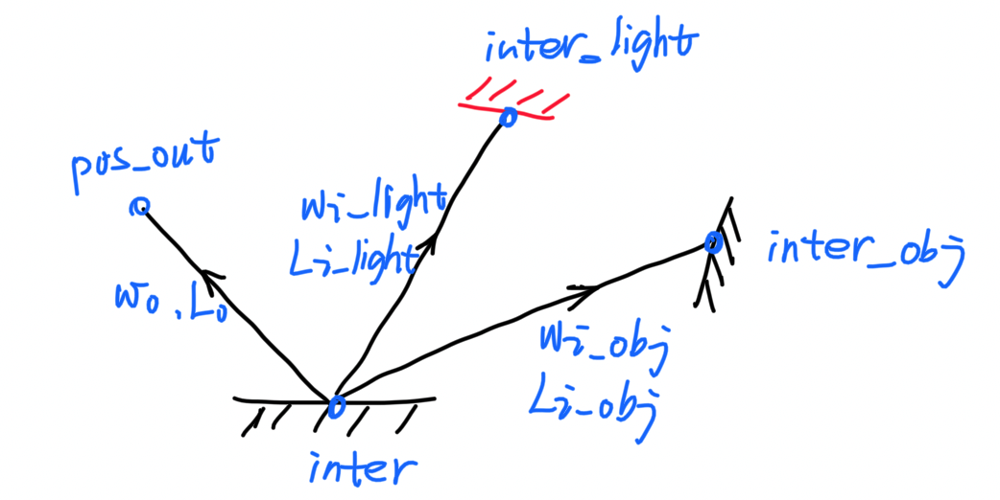


在内存中的数据结构为：

```cpp
struct PathNode {
    /* 出射光线的信息 */
    Eigen::Vector3f Lo{0.f, 0.f, 0.f};                   /* 出射光线的 Radiance */
    Direction wo = Direction::zero();                    /* 出射光线的方向 */
    Eigen::Vector3f pos_out{0.f, 0.f, 0.f};              /* 出射光线的端点 */
    Intersection inter = Intersection::no_intersect();   /* 是否和物体有交点 */

    /* 来自光源的入射光线 */
    struct {
        Eigen::Vector3f Li_light{0.f, 0.f, 0.f};
        Direction wi_light = Direction::zero();
        Intersection inter_light = Intersection::no_intersect();   /* 交点信息：材质，法线，位置等 */
    } from_light;

    /* 来自物体的入射光线 */
    struct {
        float RR{-1.f};                                            /* 记录俄罗斯轮盘赌的概率，方便 debug */
        Eigen::Vector3f Li_obj{0.f, 0.f, 0.f};
        Direction wi_obj = Direction::zero();
        Intersection inter_obj = Intersection::no_intersect();
    } from_obj;
};
```


## cast-ray 的过程

path tracing 的算法思路是：从摄像机向场景内投射光线，光线在物体之间弹射，递归地计算 Radiance

这个项目使用了对光源采样，所以需要区别对待发光体和普通物体


从摄像机投射光线，有以下几种情况：


### 1. cast-ray 的情形

情况1：没有与任何物体相交

最终的 `Lo = 0` 

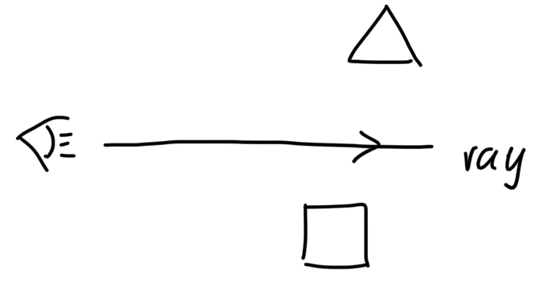


情况2:与光源相交

最终的 `Lo = Light.Lo` 

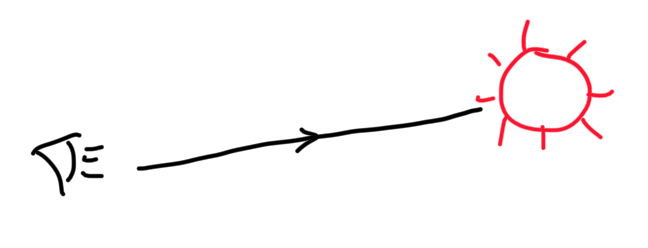


情况3:与物体相交

这种情况，需要递归地计算，以俄罗斯轮盘赌来判断光线弹射是否终结

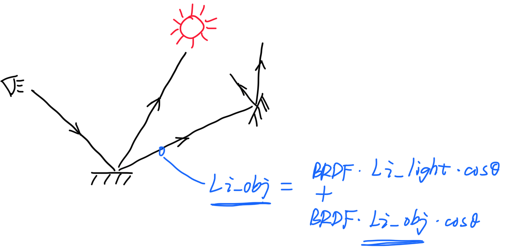


使用俄罗斯轮盘赌来控制弹射是否终结时，弹射次数期望的计算公式为：RR / (1 - RR) ^2

* 当 RR = 0.8 时，期望弹射 20 次


### 2. 对光源采样

为什么要对光源进行采样：如果采用随机采样，则光线很难和光源相交——很多采样光线是无效的


如何基于光源采样：

- 在所有光源中随机选择一点作为光源的采样点
- 判断物体的采样点和光源的采样点之间是否有阻挡
- 将反射方程通过变换积分变量的方式，变成对光源面积做积分，计算出入射的 Radiance


### 3. 防止在原地弹射

光线和物体相交之后会发生弹射，由于误差的存在，计算出后下一步的交点可能仍然在当前交点附近，也就是光线在原地弹射。


目前想到的解决办法是：让反射光线的原点关于物体法线做一个小的偏移：

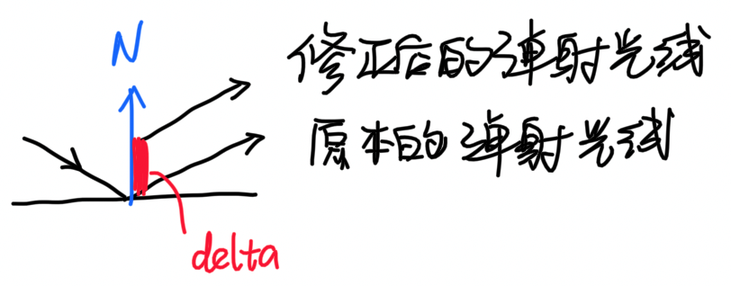


这样做会有一个问题：弹射光线的交点也和原本的交点有了一个偏移，这个偏移如何计算：

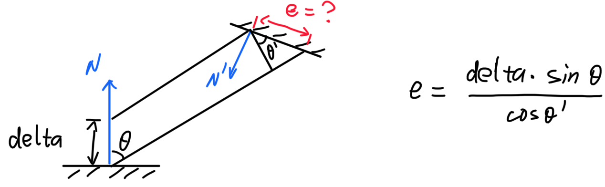


### 4. 反射方程

#### 4.1 原始的反射方程

$$
L_o = \int_{H^2}f_r  L_i   \cos\theta d\omega
$$


#### 4.2 蒙特卡洛积分计算反射方程

使用蒙特卡洛积分来进行数值计算，`n=1`，反射方程变成：
$$
L_o = f_r L_i \cos\theta / pdf
$$


#### 4.3 基于光源面积采样的反射方程

对于光源，使用了基于光源面积的采样，应该改变积分域：

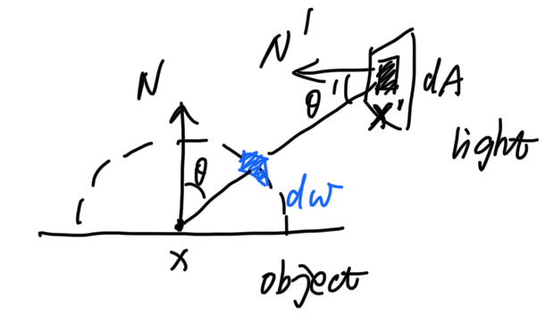


积分变量之间存在着这样的关系：
$$
dA \cos\theta' = d\omega (dis)^2
$$


对于来自光源的入射光线，反射方程为：
$$
L_o = f_r L_i \cos\theta \frac{\cos\theta'}{||x' - x||^2} / pdf
$$


#### 4.4 俄罗斯轮盘赌判断弹射条件的反射方程

光线在普通物体上弹射时，需要通过俄罗斯轮盘赌来判断是否继续弹射，改造后的反射方程为：
$$
L_o = \frac{f_r L_i \cos\theta}{pdf * RR}
$$


#### 4.5 最终的反射方程

考虑了自发光，直接光照，间接光照的反射方程为：
$$
L_o = L_E +
f_r L_i \cos\theta \frac{\cos\theta'}{||x' - x||^2} / pdf
+ \frac{f_r L_i \cos\theta}{pdf * RR}
$$


## 实现细节

一些实现的细节，踩坑的地方。


### 1. AABB 包围盒

- 射线可能与包围盒平行，需要单独考虑
- 包围盒可能退化为点/线/面，这些情况下能否计算出正确的交点


### 2. BVH

- 计算射线和 BVH 交点时，如果射线和左右子树都有交点，则取离射线原点更近的交点


### 3. MeshTriangle

- 计算射线和三角形模型交点的方法：
  - 首先以一个三角形为最小单元，建立起 BVH
  - 通过 BVH 来计算交点


## 多线程部分的示意图

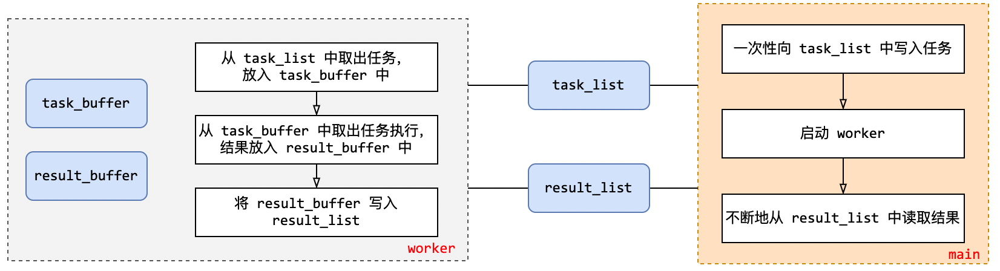


## 收获

一定要小心使用 Catch2 的 SECTION，有些代码可能会被重复执行多次


构造函数最好显式初始化所有成员变量，让函数行为可控

```cpp
class A{
public:
    A(): _val(0) {}
private:
    int _val;
};
```


类成员不要通过其默认构造函数初始化，应该手动设置初始值，行为可控

```cpp
class A{
private:
    Eigen::Vector3f _vec{ 0.f, 0.f, 0.f };
};
```


多使用工厂函数来创建对象，构造函数的表达性不强


不要在使用 `class` 的静态变量，包括全局变量，类静态成员，以及函数静态变量。因为这可能会引入两个问题

1. 可能会抛出异常
2. 构造函数的调用时机不明确

运行的静态变量，必须是 POD （Plain Old Data）的


## 接下来想要解决的问题

- 光线追踪渲染器中，可以通过减少内存的 `copy` 来优化执行效率；还可以减少内存的分配次数，比如 `shared_ptr` 的申请次数，以及 `vector` 等容器的扩容次数
- 误差是如何产生的？那些判断过程需要使用 epsilon，epsilon 的值应该定多大？滥用 epsilon 是否会额外引入误差？


