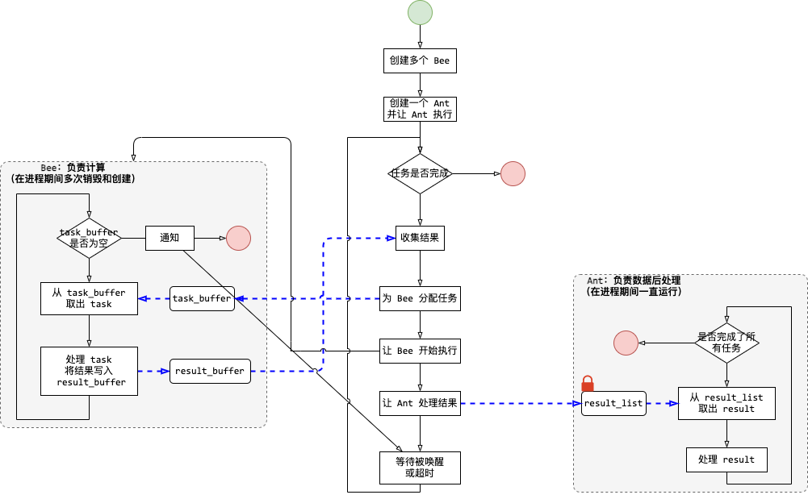
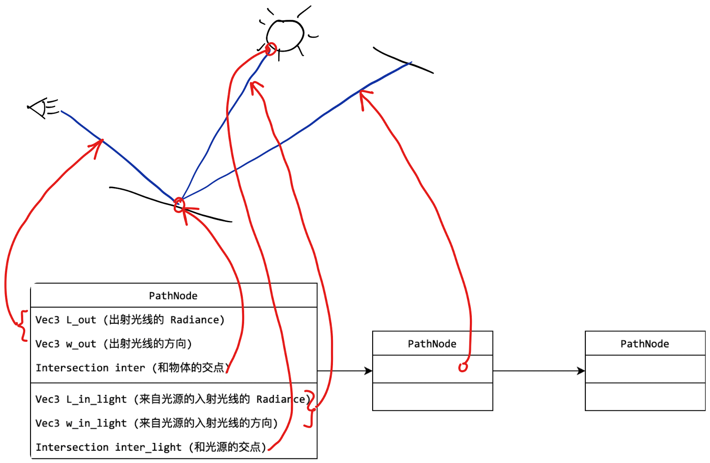

#### 模型导入

- 从 _obj 文件中导入模型，得到 `MeshTriangle[]`
- 导入材质相关的信息，得到 `Material`

#### 计算交点

- 计算和三角形的交点
- 计算和包围盒的交点
- 计算和 `MeshTriangle` 的交点
- 计算和 `BVH` 的交点

#### 采样

- 半球均匀采样
- 对场景部分物体，基于表面积进行随机采样
    - 对 `BVH` 基于面积采样
    - 对 `MeshTriangle` 基于面积采样
    - 对 `Triangle` 基于面积采样

- 采样之后，都要给出 pdf

#### 投射光线

- 如果光线遇到发光体，就返回发光值
- 如果遇到物体，
    - 先对光源采样
    - 再对其他物体采样

#### BRDF

- phong 着色模型的 BRDF
- 微表面模型的 BRDF

#### 心得

- 一定要小心使用 Catch2 的 SECTION，有些代码可能会被重复执行多次
- 构造函数最好显式初始化所有成员变量，让函数行为可控
  
```cpp
class A{
public:
    A(): _val(0) {}
private:
    int _val;
};
```
- 类成员不要通过其默认构造函数初始化，应该手动设置初始值，行为可控

```cpp
class A{
private:
    Eigen::Vector3f _vec{ 0.f, 0.f, 0.f };
};
```

- 多使用工厂函数来创建对象，构造函数的表达性不强

#### 多线程部分的示意图



#### 路径的数据结构及示意图



#### 优化方向
- 光线追踪渲染器中，可以通过减少内存的 `copy` 来优化
- 还可以减少内存的分配次数，比如 `shared_ptr` 的申请次数，以及 `vector` 等容器的扩容次数
